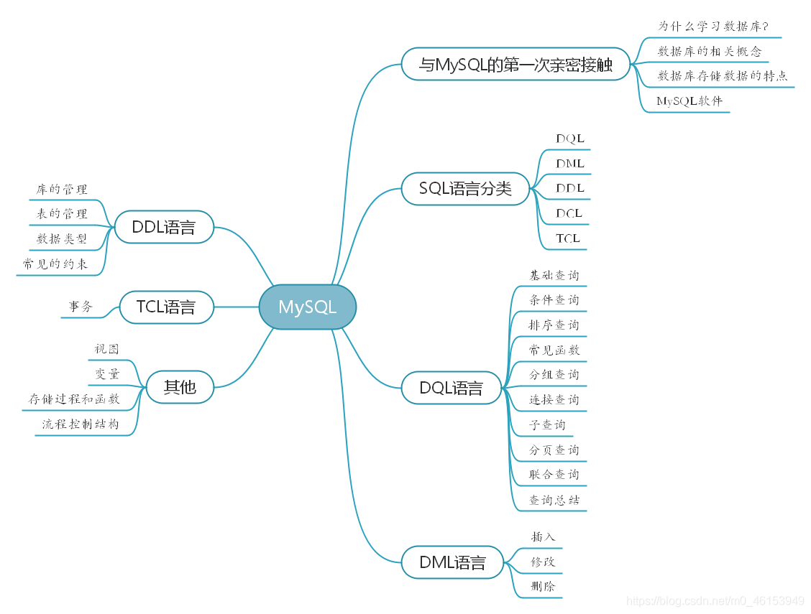
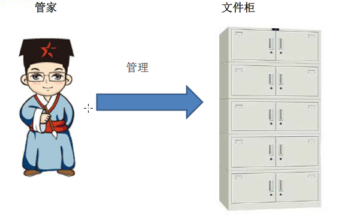

## 						MySQL数据库

### 一、整体大纲



### 二、与Mysql的第一次亲密接触

#### 2.1 为什么学习数据库？

- 实现数据持久化
- 使用完整的管理系统统一管理，易于查询

#### 2.2 数据库的相关概念

- DB：数据库（database）：存储数据的 "仓库"。它保存了一些列有组织的数据。

- DBMS

  - 数据库管理系统（Database Management System）。数据库是通过DBMS创建和操作的容器

  - 常见的数据库管理系统：MySQL、Oracle、DB2、SqlServer等	

- SQL
  - 结构化查询语言（Structure Query Language）：专门用来与数据库通信的语言。
  - SQL的优点：① 简单易学；②不是某个特定数据库供应商专有的语言，几乎所有的DBMS都支持SQL；③虽然简单，但实际上是一种强有力的语言，灵活使用其语言元素，可以进行非常复杂和高级的数据库操作。



##  

### 三、数据库存储数据的特点

- 1、数据放到表中，表在放到库中
- 2、一个数据库中可以有多个表，每个表都有一个名字，用来表示自己。表明具有唯一性。
- 3、表具有一些特性，这些特性定义了数据中表中如何存储，类似java中 "类" 的设计
- 4、表由列组成，我们也称为字段。所有表都是由一个或多个列组成的，每一列类似 java 中的  【属性】
- 5、表中的数据是按行存储的，每一行类似于 java 中的 【对象】

### 四、Mysql 软件安装

#### 4.1 介绍

- MySQL数据库隶属于MySQLAB公司，总部位于瑞典，后被oracle收购。
- 优点：①成本低：开放源代码，一般可以免费试用；②简单：很容易安装和使用；③性能高：执行很快。

#### 4.2 安装

- DBMS分为两类：①基于共享文件系统的DBMS （Access）；②基于客户机——服务器的DBMS（MySQL、Oracle、SqlServer）。
- 版本可分为：社区版（免费），企业版（收费）。
- Windows平台下下载：http://dev.mysql.com/downloads/mysql

### 五、启动和停止Mysql服务

#### 5.1 方式一：

- 右击此电脑—管理—服务—启动或停止MySQL服务

#### 5.2 方式二：

```my
启动：net start mysql 【服务的名称】
停止：net stop mysql  【服务的名称】
```

#### 5.3 Mysql 登录/退出

```xml
登录
mysql -h 主机名 -u用户名 -p密码
【例如】mysql -h localhost -u root -proot

退出
exit 或 ctrl+c
```

### 六、 Mysql 常见的命令介绍

#### 6.1 mysql 常见命令

```gas
1、进入mysql，在命令行中输入 
mysql -uroot -proot
例 ： mysql -uroot -proot

2、查看mysql有哪些数据库
show databases;

3、新建一个数据库
create database 数据库名;
例：create database user;

4、选择一个数据库
use 数据库名称;
例: use mydatabase;

5、查询当前数据库中的所有数据表
show tables;

6、新建一个数据表
create table user(
	id int,
	name varchar(20)
);

7、查看表的结构
desc 表名名称;
例：desc user;

8、查看表中的所有记录
select * from 表名;
例：select *　from user;

9、向表中插入记录
insert into 表名(列名) values (列对应的值的列表);
注意：插入 varchar 或 data 型的数据要用单引号引起来
例： insert into user (id,name) values(1,"Tom");

10、修改记录
update 表名 set 列1 = 新值, 列2 = 新值 where ...
例：update user set name="Jerry" where id = 1;

11、删除记录
delete from 表名 where ...
例: delete from user where id = 1;

12、删除数据库中的表
drop table 表名;
例：drop table user;
```

#### 6.2 查看mysql服务端版本的命令

```gas
登录到mysql服务端
select version();

没有登录到mysql服务端
在cmd 命令界面输入：mysql --version
```

### 七、Mysql的语法规范

#### 7.1 mysql规范

- 不区分大小写，但建议关键字大写，表名，列名小写
- 每句话用 ";"或\G结尾，最好分好结尾
- 每条命令根据需要，可以进行缩进或换行
- 注释：①单行注释：#注释文字；②单行注释：--注释文字；③多行注释： 注释文字

#### 7.2 sql语言的分类

- DQL（Data Query Language）：数据查询语言，用于检索数据库中的数据，主要是 `SELECT` 语句；
- DML（Data Manipulation Language）：数据操纵语言，用于改变数据库中的数据，主要包括 `INSERT`、`DROP`、`ALERT` 语句;
- DDL（Data Definition Language）：数据库定义语言，用于数据库和表的创建，修改，删除。主要包括 `CREATE` 、`DROP`、`ALERT` 语句；

- DCL （Data Control Language ）：数据控制语言，用于定义用户的访问权限和安全级别。主要包括  `GRANT` 和 `REVOKE` 语句；
- TCL（Transaction Control Language)：事务控制语言，用于维护数据的一致性，包括COMMIT、ROLLBACK和SAVEPOINT语句。

### 八、后文需要的数据库表文件

#### 8.1 myemployees 文件

```gas
/*
SQLyog Ultimate v10.00 Beta1
MySQL - 5.5.15 : Database - myemployees
*********************************************************************
*/


/*!40101 SET NAMES utf8 */;

/*!40101 SET SQL_MODE=''*/;

/*!40014 SET @OLD_UNIQUE_CHECKS=@@UNIQUE_CHECKS, UNIQUE_CHECKS=0 */;
/*!40014 SET @OLD_FOREIGN_KEY_CHECKS=@@FOREIGN_KEY_CHECKS, FOREIGN_KEY_CHECKS=0 */;
/*!40101 SET @OLD_SQL_MODE=@@SQL_MODE, SQL_MODE='NO_AUTO_VALUE_ON_ZERO' */;
/*!40111 SET @OLD_SQL_NOTES=@@SQL_NOTES, SQL_NOTES=0 */;
CREATE DATABASE /*!32312 IF NOT EXISTS*/`myemployees` /*!40100 DEFAULT CHARACTER SET gb2312 */;

USE `myemployees`;

/*Table structure for table `departments` */

DROP TABLE IF EXISTS `departments`;

CREATE TABLE `departments` (
  `department_id` int(4) NOT NULL AUTO_INCREMENT,
  `department_name` varchar(3) DEFAULT NULL,
  `manager_id` int(6) DEFAULT NULL,
  `location_id` int(4) DEFAULT NULL,
  PRIMARY KEY (`department_id`),
  KEY `loc_id_fk` (`location_id`),
  CONSTRAINT `loc_id_fk` FOREIGN KEY (`location_id`) REFERENCES `locations` (`location_id`)
) ENGINE=InnoDB AUTO_INCREMENT=271 DEFAULT CHARSET=gb2312;

/*Data for the table `departments` */

insert  into `departments`(`department_id`,`department_name`,`manager_id`,`location_id`) values (10,'Adm',200,1700),(20,'Mar',201,1800);

/*Table structure for table `employees` */

DROP TABLE IF EXISTS `employees`;

CREATE TABLE `employees` (
  `employee_id` int(6) NOT NULL AUTO_INCREMENT,
  `first_name` varchar(20) DEFAULT NULL,
  `last_name` varchar(25) DEFAULT NULL,
  `email` varchar(25) DEFAULT NULL,
  `phone_number` varchar(20) DEFAULT NULL,
  `job_id` varchar(10) DEFAULT NULL,
  `salary` double(10,2) DEFAULT NULL,
  `commission_pct` double(4,2) DEFAULT NULL,
  `manager_id` int(6) DEFAULT NULL,
  `department_id` int(4) DEFAULT NULL,
  `hiredate` datetime DEFAULT NULL,
  PRIMARY KEY (`employee_id`),
  KEY `dept_id_fk` (`department_id`),
  KEY `job_id_fk` (`job_id`),
  CONSTRAINT `dept_id_fk` FOREIGN KEY (`department_id`) REFERENCES `departments` (`department_id`),
  CONSTRAINT `job_id_fk` FOREIGN KEY (`job_id`) REFERENCES `jobs` (`job_id`)
) ENGINE=InnoDB AUTO_INCREMENT=207 DEFAULT CHARSET=gb2312;

/*Data for the table `employees` */

insert  into `employees`(`employee_id`,`first_name`,`last_name`,`email`,`phone_number`,`job_id`,`salary`,`commission_pct`,`manager_id`,`department_id`,`hiredate`) values (100,'Steven','K_ing','SKING','515.123.4567','AD_PRES',24000.00,NULL,NULL,90,'1992-04-03 00:00:00'),(101,'Neena','Kochhar','NKOCHHAR','515.123.4568','AD_VP',17000.00,NULL,100,90,'1992-04-03 00:00:00');

/*Table structure for table `jobs` */

DROP TABLE IF EXISTS `jobs`;

CREATE TABLE `jobs` (
  `job_id` varchar(10) NOT NULL,
  `job_title` varchar(35) DEFAULT NULL,
  `min_salary` int(6) DEFAULT NULL,
  `max_salary` int(6) DEFAULT NULL,
  PRIMARY KEY (`job_id`)
) ENGINE=InnoDB DEFAULT CHARSET=gb2312;

/*Data for the table `jobs` */

insert  into `jobs`(`job_id`,`job_title`,`min_salary`,`max_salary`) values ('AC_ACCOUNT','Public Accountant',4200,9000),('AC_MGR','Accounting Manager',8200,16000);

/*Table structure for table `locations` */

DROP TABLE IF EXISTS `locations`;

CREATE TABLE `locations` (
  `location_id` int(11) NOT NULL AUTO_INCREMENT,
  `street_address` varchar(40) DEFAULT NULL,
  `postal_code` varchar(12) DEFAULT NULL,
  `city` varchar(30) DEFAULT NULL,
  `state_province` varchar(25) DEFAULT NULL,
  `country_id` varchar(2) DEFAULT NULL,
  PRIMARY KEY (`location_id`)
) ENGINE=InnoDB AUTO_INCREMENT=3201 DEFAULT CHARSET=gb2312;

/*Data for the table `locations` */

insert  into `locations`(`location_id`,`street_address`,`postal_code`,`city`,`state_province`,`country_id`) values (1000,'1297 Via Cola di Rie','00989','Roma',NULL,'IT'),(1100,'93091 Calle della Testa','10934','Venice',NULL,'IT');

/*!40101 SET SQL_MODE=@OLD_SQL_MODE */;
/*!40014 SET FOREIGN_KEY_CHECKS=@OLD_FOREIGN_KEY_CHECKS */;
/*!40014 SET UNIQUE_CHECKS=@OLD_UNIQUE_CHECKS */;
/*!40111 SET SQL_NOTES=@OLD_SQL_NOTES */;

```

#### 8.2 girl 数据库文件

```gas
/*
SQLyog Ultimate v10.00 Beta1
MySQL - 5.7.18-log : Database - girls
*********************************************************************
*/
/*!40101 SET NAMES utf8 */;

/*!40101 SET SQL_MODE=''*/;

/*!40014 SET @OLD_UNIQUE_CHECKS=@@UNIQUE_CHECKS, UNIQUE_CHECKS=0 */;
/*!40014 SET @OLD_FOREIGN_KEY_CHECKS=@@FOREIGN_KEY_CHECKS, FOREIGN_KEY_CHECKS=0 */;
/*!40101 SET @OLD_SQL_MODE=@@SQL_MODE, SQL_MODE='NO_AUTO_VALUE_ON_ZERO' */;
/*!40111 SET @OLD_SQL_NOTES=@@SQL_NOTES, SQL_NOTES=0 */;
CREATE DATABASE /*!32312 IF NOT EXISTS*/`girls` /*!40100 DEFAULT CHARACTER SET utf8 */;

USE `girls`;

/*Table structure for table `admin` */

DROP TABLE IF EXISTS `admin`;

CREATE TABLE `admin` (
  `id` int(11) NOT NULL AUTO_INCREMENT,
  `username` varchar(10) NOT NULL,
  `password` varchar(10) NOT NULL,
  PRIMARY KEY (`id`)
) ENGINE=InnoDB AUTO_INCREMENT=3 DEFAULT CHARSET=utf8;

/*Data for the table `admin` */

insert  into `admin`(`id`,`username`,`password`) values (1,'john','8888'),(2,'lyt','6666');

/*Table structure for table `beauty` */

DROP TABLE IF EXISTS `beauty`;

CREATE TABLE `beauty` (
  `id` int(11) NOT NULL AUTO_INCREMENT,
  `name` varchar(50) NOT NULL,
  `sex` char(1) DEFAULT '女',
  `borndate` datetime DEFAULT '1987-01-01 00:00:00',
  `phone` varchar(11) NOT NULL,
  `photo` blob,
  `boyfriend_id` int(11) DEFAULT NULL,
  PRIMARY KEY (`id`)
) ENGINE=InnoDB AUTO_INCREMENT=13 DEFAULT CHARSET=utf8;

/*Data for the table `beauty` */

insert  into `beauty`(`id`,`name`,`sex`,`borndate`,`phone`,`photo`,`boyfriend_id`) values (1,'柳岩','女','1988-02-03 00:00:00','18209876577',NULL,8),(2,'苍老师','女','1987-12-30 00:00:00','18219876577',NULL,9),(3,'Angelababy','女','1989-02-03 00:00:00','18209876567',NULL,3),(4,'热巴','女','1993-02-03 00:00:00','18209876579',NULL,2),(5,'周冬雨','女','1992-02-03 00:00:00','18209179577',NULL,9),(6,'周芷若','女','1988-02-03 00:00:00','18209876577',NULL,1),(7,'岳灵珊','女','1987-12-30 00:00:00','18219876577',NULL,9),(8,'小昭','女','1989-02-03 00:00:00','18209876567',NULL,1),(9,'双儿','女','1993-02-03 00:00:00','18209876579',NULL,9),(10,'王语嫣','女','1992-02-03 00:00:00','18209179577',NULL,4),(11,'夏雪','女','1993-02-03 00:00:00','18209876579',NULL,9),(12,'赵敏','女','1992-02-03 00:00:00','18209179577',NULL,1);

/*Table structure for table `boys` */

DROP TABLE IF EXISTS `boys`;

CREATE TABLE `boys` (
  `id` int(11) NOT NULL AUTO_INCREMENT,
  `boyName` varchar(20) DEFAULT NULL,
  `userCP` int(11) DEFAULT NULL,
  PRIMARY KEY (`id`)
) ENGINE=InnoDB AUTO_INCREMENT=5 DEFAULT CHARSET=utf8;

/*Data for the table `boys` */

insert  into `boys`(`id`,`boyName`,`userCP`) values (1,'张无忌',100),(2,'鹿晗',800),(3,'黄晓明',50),(4,'段誉',300);

/*!40101 SET SQL_MODE=@OLD_SQL_MODE */;
/*!40014 SET FOREIGN_KEY_CHECKS=@OLD_FOREIGN_KEY_CHECKS */;
/*!40014 SET UNIQUE_CHECKS=@OLD_UNIQUE_CHECKS */;
/*!40111 SET SQL_NOTES=@OLD_SQL_NOTES */;

```

#### 8.3 工资等级文件

```gas
CREATE TABLE job_grades
(grade_level VARCHAR(3),
 lowest_sal  int,
 highest_sal int);

INSERT INTO job_grades
VALUES ('A', 1000, 2999);

INSERT INTO job_grades
VALUES ('B', 3000, 5999);

INSERT INTO job_grades
VALUES('C', 6000, 9999);

INSERT INTO job_grades
VALUES('D', 10000, 14999);

INSERT INTO job_grades
VALUES('E', 15000, 24999);

INSERT INTO job_grades
VALUES('F', 25000, 40000);
```

#### 8.4 学生数据库文件

```gas
DROP DATABASE IF EXISTS student;
CREATE DATABASE student;
USE student;
CREATE TABLE student(
	studentno VARCHAR(10) NOT NULL PRIMARY KEY,
	studentname VARCHAR(20) NOT NULL,
	loginpwd VARCHAR(8) NOT NULL,
	sex CHAR(1) ,
	majorid INT NOT NULL REFERENCES grade(majorid),
	phone VARCHAR(11),
	email VARCHAR(20) ,
	borndate DATETIME
)DEFAULT CHARSET=utf8;

CREATE TABLE major(
	majorid INT NOT NULL AUTO_INCREMENT PRIMARY KEY,
	majorname VARCHAR(20) NOT  NULL

)DEFAULT CHARSET=utf8;
CREATE TABLE result(
	id INT NOT NULL AUTO_INCREMENT PRIMARY KEY,
	studentno VARCHAR(10) NOT NULL REFERENCES student(studentno),
	score DOUBLE
)DEFAULT CHARSET=utf8;


INSERT INTO major VALUES(NULL,'javaee');
INSERT INTO major VALUES(NULL,'html5');
INSERT INTO major VALUES(NULL,'android');


INSERT INTO student VALUES('S001','张三封','8888','男',1,'13288886666','zhangsanfeng@126.com','1966-9-1');
INSERT INTO student VALUES('S002','殷天正','8888','男',1,'13888881234','yintianzheng@qq.com','1976-9-2');
INSERT INTO student VALUES('S003','周伯通','8888','男',2,'13288886666','zhoubotong@126.com','1986-9-3');
INSERT INTO student VALUES('S004','张翠山','8888','男',1,'13288886666',NULL,'1995-9-4');
INSERT INTO student VALUES('S005','小小张','8888','女',3,'13288885678','xiaozhang@126.com','1990-9-5');

INSERT INTO student VALUES('S006','张无忌','8888','男',2,'13288886666','zhangwuji@126.com','1998-8-9');
INSERT INTO student VALUES('S007','赵敏','0000','女',1,'13288880987','zhaomin@126.com','1998-6-9');
INSERT INTO student VALUES('S008','周芷若','6666','女',1,'13288883456','zhouzhiruo@126.com','1996-7-9');
INSERT INTO student VALUES('S009','殷素素','8888','女',1,'13288886666','yinsusu@163.com','1986-1-9');
INSERT INTO student VALUES('S010','宋远桥','6666','男',3,'1328888890','songyuanqiao@qq.com','1996-2-9');


INSERT INTO student VALUES('S011','杨不悔','6666','女',2,'13288882345',NULL,'1995-9-9');
INSERT INTO student VALUES('S012','杨逍','9999','男',1,'13288885432',NULL,'1976-9-9');
INSERT INTO student VALUES('S013','纪晓芙','9999','女',3,'13288888765',NULL,'1976-9-9');
INSERT INTO student VALUES('S014','谢逊','9999','男',1,'13288882211',NULL,'1946-9-9');
INSERT INTO student VALUES('S015','宋青书','9999','男',3,'13288889900',NULL,'1976-6-8');

INSERT INTO result VALUES(NULL,'s001',100);
INSERT INTO result VALUES(NULL,'s002',90);
INSERT INTO result VALUES(NULL,'s003',80);

INSERT INTO result VALUES(NULL,'s004',70);
INSERT INTO result VALUES(NULL,'s005',60);
INSERT INTO result VALUES(NULL,'s006',50);
INSERT INTO result VALUES(NULL,'s006',40);
INSERT INTO result VALUES(NULL,'s005',95);
INSERT INTO result VALUES(NULL,'s006',88);
```

<<<<<<< HEAD

=======

>>>>>>> 9199543 (mysql 笔记整理2 DQL语言)


