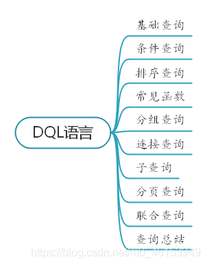

## 								Mysql 数据库2

### 一、Mysql DQL语言



### 二、基础查询

#### 2.1 语法：

- select 查询列表from表名；

- 类似于System.out.println(打印东西)；

- 特点：

  查询列表可以是：表中的字段，常量值，表达式，函数

  查询的结果可以是一个虚拟表格；

#### 2.2 案例：

```gas
USE myemployees;

1.查询表单中的单个字段
select last_name from employees;

2.查询表中多个字段
select last_name,salary,email from employees;

3.查询表中的所有字段
select * from employees;

4.查询常量
# select 常量值
# 注意：字符和日期型的常量值必须用单引号引起来，数值类型不需要
select 100;
select 'join';

5.查询函数
select version();

6.查询表达式
select 100%98;

7.起别名
#方式一:使用AS
SELECT 100%98 AS 结果;
SELECT last_name AS 姓,first_name AS 名 FROM employees;

#方式二:使用空格
SELECT last_name 姓,first_name 名 FROM employees;

#案例:查询salary,结果显示 out put
SELECT salary AS "out put" FROM employees;

8.去重
# select distinct 字段名 from 表名;
#案例：查询员工表中涉及的所有部门编号
select distinct department_id from employees;

9.+号的作用
#案例：查询员工的名和姓，并显示为姓名
select 100+90; 两个操作都为数值类型，做加法运算
select '123+90';其中一方为字符型，试图将字符型数值类型转换为数值类型如果转换成功，则继续做加法运算
select 'john + 90';如果转换失败，这件字符类型数值转换为0
select null+0;只要其中一方为null，则结果肯定为null；
SELECT last_name + first_name AS 姓名 FROM employees;

10.concat 函数
# 功能：拼接字符
select concat('a','b','c') AS 结果 from employees;
select concat(last_name,first_name) AS 姓名 from employees;

11.【补充】ifnull 函数
# 功能：判断某个字段或表达式是否为null，如果为null 返则返回1，否则返回0
select ifnull(ccommission_pct,0) from employees;
```

### 三、条件查询

#### 3.1 语法

- select 查询列表from表名where筛选条件;

- 分类

```gas
一、按条件表达式筛选
	条件运算符:> < = != <> >= <= <=>安全等于
二、按逻辑表达式筛选
	逻辑运算符:&& || |
	and or not
	
	&& 和 and:两个条件都为true，结果为true，反之为false
	|| 和 or:只要有一个条件为true，结果为true，反之为false
	! 或 not:如果连接的条件本身为false，结果为true，反之为false	
	
三、模糊查询
	like:一般搭配通配符使用，可以判断字符型或数值型
	通配符：%任意多个字符，_任意单个字符
	like、between and、in、is null
```

#### 3.2 案例：

```mysql
# 1.按条件表达式筛选
# 案例1查询工资>12000的员工信息
select * from employees where salary > 12000;

# 案例2：查询部门编号不等于90号的员工名和部门编号
select last_name,department_id from employees where department_id <> 90;

#2.按逻辑表达式筛选
#案例1：查询工资 在10000到20000之间的员工名，工资及奖金
select Last_name,salary,commission_pct from employees where salary >= 10000 and salary <= 20000;

#案例2：查询部门编号不是90-110之间，或者工资高于15000的员工信息
select * from employees where department < 90 or department_id > 110 or salary > 15000;

#3.模糊查询
# like
# 案例1：查询员工命中包含字符a的员工信息
select * from employees where last_name LIKE '%a%';

# 案例2：查询员工名中第三个字符为b，第五个字符为a的员工名和工资
select last_name,salary from employees where lase_name LIKE '__b_a%';

# 案例3：查询员工名中第二个字符为 _ 的员工名
select last_name from employees where last_name LIKE '_\_%';

# between and
# 案例1：查询员工编号在100 到120之间的员工信息
select * from employees where employee_id >= 100 and employee_id <= 120;
select * from employees where employee_id between 100 and 120;

# 注意事项：
1.提高语言简洁度
2.包含临界值
3.两个临界值不能调换顺序

# 4.in
# 功能：判断某个字段的值是否属于 in 列表中的某一项
# 特点：
# 1.使用in提高语句简洁度
# 2.in列表的值类型必须为一致或兼容
# 案例1：查询员工的工种编号是 IT_PRO,AD_VP,AD_PRES中的一个员工名和公众编号

select last_name,job_id from employees where job_id in('IT_PROG','AD_PRES','AD_VP')

# 5. is null
# =或 <> 不能用于判断null 值
# is null 或 is not null 可以判断 null 值
# 案例1：查询没有奖金的员工名和奖金率
select last_name,commission_pct from employees where commission_pct is null;
select last_name,commission_pct from employees where commission_pct is not null;

#安全等于<=>
select last_name,commission_pct from employees where <=> 12000;
```

### 四、排序查询

#### 4.1 引入

- select * from employees;

#### 4.2 语法

- select  查询列表 from 表 【where 筛选条件】 order by

#### 4.3 特点：

- asc 代表的是升序，desc 代表的降序，不写默认为升序；
- order by 子句中可以支持单个字段，多个字段，表达式，函数，别名；
- order by子句一般是放在查询语句的最后面，limit 子句除外；

#### 4.4 案例：

```mysql
# 案例1：查询员工信息，要求工资从高到低的排序
select * from employees  order by salary desc;
select * from employees  order by salary asc;

#案例2：查询部门编号 >=90,按入职时间的先后进行排序
select * from employees where department_id >= 90 order by hiredate ASC;

#案例3：按照年薪的高低显示员工的信息和年薪[按表达式排序]
select *,salary*12*(1+IFNULL(commission_pct,0)) 年薪 from employees order by salary*12*(1+IFNULL(commission_pct,0)) DESC;

#案例4：按姓名的长度显示员工的姓名和工资【按函数排序】
select length(last_name) 字节长度，last_name,salary from employees order by length(last_name) DESC;

#案例5：查询员工信息，要求按工资排序，在按照员工编号排序【多个字段排序】
select * from employees order by salary ASC，employee_id DESC;
```

### 五、常见函数

#### 5.1 概念：

- 类似于Java的方法，将一组逻辑语句封装在方法体中，对外暴露方法名

#### 5.2 优点：

- 隐藏了实现细节
- 提高了代码的重用性

#### 5.3 语法：

- 叫什么(函数名)
- 干什么（函数功能）

#### 5.4 分类：

- 单行函数，如concat、length、ifnull  等
- 分组函数，做统计使用

#### 5.5 单行函数

- 单行函数分类：字符函数，数学函数，日期函数，其他函数，流程控制函数

#### 5.6 字符函数具体案例：

```mysql
#一.字符函数
#1.length 获取参数值的字节值
SELECT LENGTH('subei');
SELECT LENGTH('鬼谷子qwe');

SHOW VARIABLES LIKE '%char%';

#2.concat 拼接字符串
SELECT CONCAT(last_name,'_',first_name) 姓名 FROM employees;

#3.upper:变大写、lower：变小写
SELECT UPPER('ton');
SELECT LOWER('ton');

#示例：将姓变大写，名变小写，然后拼接
SELECT CONCAT(UPPER(last_name),LOWER(first_name)) 姓名 FROM employees;

#4.substr、substring
#注意:索引从1开始

#截取从指定所有处后面的所以字符
SELECT SUBSTR('吴刚伐桂在天上',4) out_put;

#截取从指定索引处指定字符长度的字符
SELECT SUBSTR('吴刚伐桂在天上',1,2) out_put;

#案例:姓名中首字符大写,其他字符小写，然后用_拼接,显示出来
SELECT CONCAT(UPPER(SUBSTR(last_name,1,1)),'_',LOWER(SUBSTR(last_name,2))) out_put FROM employees;

#5.instr:获取子串第一次出现的索引,找不到返回0
SELECT INSTR('MySQL技术进阶','技术') AS out_put;

#6.trim:去前后空格

SELECT LENGTH(TRIM('	霍山	')) AS out_put;

SELECT TRIM('+' FROM '++++李刚+++刘邦+++') AS out_put;

#7.lpad:用指定的字符实现左填充指定长度
SELECT LPAD('梅林',8,'+') AS out_put;

#8.rpad:用指定的字符实现右填充指定长度
SELECT RPAD('梅林',5,'&') AS out_put;

#9.replace:替换
SELECT REPLACE('莉莉伊万斯的青梅竹马是詹姆','詹姆','斯内普') AS out_put;

```

#### 5.7 数学函数具体案例：

```mysql
#1.round:四舍五入
SELECT ROUND(1.45);
SELECT ROUND(1.567,2);

#2.ceil:向上取整,返回>=该参数的最小整数
SELECT CEIL(1.005);
SELECT CEIL(-1.002);

#3.floor:向下取整,返回<=该参数的最大整数
SELECT FLOOR(-9.99);

#4.truncate:截断
SELECT TRUNCATE(1.65,1);

#5.mod:取余
SELECT MOD(10,3);

#6.rand:获取随机数，返回0-1之间的小数
SELECT RAND();
```

#### 5.8 日期函数具体案例：

```mysql
#1.now:返回当前系统时间+日期
SELECT NOW();

#2.year:返回年
SELECT YEAR(NOW());
SELECT YEAR(hiredate) 年 FROM employees;

#3.month:返回月
#MONTHNAME:以英文形式返回月
SELECT MONTH(NOW());
SELECT MONTHNAME(NOW());

#4.day:返回日
#DATEDIFF:返回两个日期相差的天数
SELECT DAY(NOW());
SELECT DATEDIFF('2020/06/30','2020/06/21');

#5.str_to_date:将字符通过指定格式转换成日期
SELECT STR_TO_DATE('2020-5-13','%Y-%c-%d') AS out_put;

#6.date_format:将日期转换成字符
SELECT DATE_FORMAT('2020/6/6','%Y年%m月%d日') AS out_put;
SELECT DATE_FORMAT(NOW(),'%Y年%m月%d日') AS out_put;

#7.curdate:返回当前日期
SELECT CURDATE();

#8.curtime:返回当前时间
SELECT CURTIME();
```

#### 5.9 其他函数具体案例：

```mysql
#version 当前数据库服务器的版本
SELECT VERSION();

#database 当前打开的数据库
SELECT DATABASE();

#user当前用户
SELECT USER();

#password('字符')：返回该字符的密码形式
SELECT PASSWORD('a');

#md5('字符'):返回该字符的md5加密形式
SELECT MD5('a');
```

#### 5.10 流程控制函数具体案例：

```mysql
#1.if函数: if else效果

SELECT IF(10<5,'大','小');

SELECT last_name,commission_pct,IF(commission_pct IS NULL,'没奖金！！！','有奖金!!!') 备注 FROM employees;

#2.case函数
#使用一:switch case 的效果
/*
java中
switch(变量或表达式){
	case 常量1:语句1;break;
	...
	default:语句n;break;
}

mysql中

case 要判断的变量或表达式
when 常量1 then 要显示的值1或语句1
when 常量2 then 要显示的值2或语句2
...
else 要显示的值n或语句n
end

#案例:查询员工的工资,要求:

部门号=30,显示的工资为1.1倍
部门号=40,显示的工资为1.2倍
部门号=50,显示的工资为1.3倍
其他部门,显示的工资为原工资

*/

SELECT salary 原始工资,department_id,
CASE department_id
WHEN 30 THEN salary*1.1
WHEN 40 THEN salary*1.2
WHEN 50 THEN salary*1.3
ELSE salary
END AS 新工资
FROM employees;

#3.case函数的使用二:类似于多重if

mysql中:
case 
when 条件1 then 要显示的值1或语句1
when 条件2 then 要显示的值2或语句2
...
else 要显示的值n或语句n
end

#案例:查询员工的工资的情况
/*
如果工资>20000，显示A级别
如果工资>15000，显示B级别
如果工资>10000，显示c级别
否则，显示D级别
*/

SELECT salary,
CASE
WHEN salary>20000 THEN 'A'
WHEN salary>15000 THEN 'B'
WHEN salary>10000 THEN 'C'
ELSE 'D'
END AS 工资等级
FROM employees;
```

#### 5.11 分组函数

- 功能：用作统计使用，又称为聚合函数或统计函数或组函数

- 分类：sum求和，avg平均值，max最大值，min最小值count计算葛素

- 特点：

  1. sum和avg一般用于处理数值型

  2. max、min、count 处理任何数据类型

  3. 以上分组函数都忽略null

  4. 丢可以搭配distinct使用，实现去重的统计select sum (distinct 字段) from 表;

  5. count函数

     count(字段)：统计该字段非空值的个数

     count(*)：统计结果集的行数

  6. 和分组函数一同查询的字段，要求是group by后出现的字段

```mysql
#1.简单使用
SELECT SUM(salary) FROM employees;
SELECT AVG(salary) FROM employees;
SELECT MAX(salary) FROM employees;
SELECT MIN(salary) FROM employees;
SELECT COUNT(salary) FROM employees;

SELECT SUM(salary) 和,ROUND(AVG(salary),2) 平均,MAX(salary) 最高,MIN(salary) 最低,COUNT(salary) 个数
FROM employees;

#2.参数支持哪些数据类型

SELECT SUM(last_name),AVG(last_name) FROM employees;
SELECT SUM(hiredate),AVG(hiredate) FROM employees;

SELECT MAX(last_name),MIN(last_name) FROM employees;
SELECT MAX(hiredate),MIN(hiredate) FROM employees;

SELECT COUNT(commission_pct) FROM employees;
SELECT COUNT(last_name) FROM employees;

#3.是否忽略null

SELECT SUM(commission_pct),AVG(commission_pct) FROM employees;

SELECT commission_pct FROM employees;

SELECT SUM(commission_pct),AVG(commission_pct),SUM(commission_pct)/35,AVG(commission_pct)/107 FROM employees;

SELECT MAX(commission_pct),MIN(commission_pct) FROM employees;

SELECT COUNT(commission_pct) FROM employees;

#4.和distinct搭配

SELECT SUM(DISTINCT salary),SUM(salary) FROM employees;

SELECT COUNT(DISTINCT salary),COUNT(salary) FROM employees;

#5.count函数详解

SELECT COUNT(salary) FROM employees;
SELECT COUNT(*) FROM employees;
SELECT COUNT(1) FROM employees;
/*
效率上：
MyISAM存储引擎，count(*)最高
InnoDB存储引擎，count(*)和count(1)效率>count(字段)
*/

#6.和分组函数一同查询的字段有限制

SELECT AVG(salary),employee_id FROM employees;
```

#### 5.12 分组查询

- 语法：

```mysql
select 分组函数,分组后的字段
from 表
【where 筛选条件】
group by 分组的字段
【having 分组后的筛选】
【order by 排序列表】
```

- 注意：查询列表必须特殊，要求是分组函数和group by 后出现的字段

- 分组查询中的筛选条件分为两类

```mysql
			使用关键字	筛选的表	位置
分组前筛选	where		原始表		group by的前面
分组后筛选	having		分组后的结果	group by的后面
1.分组函数做条件肯定是放在having子句中
2.能用分组前筛选的，就优先考虑使用分组前筛选
```

- group by 子句支持单个字段分组，多个字段分组（多个字段之间用逗号隔开没有顺序要求），表达式或函数（使用较少）
- 也可以添加排序（排序放在整个分组查询的最后）


```mysql
# 查询每个部门的平均工资
select AVG(salary) from employees;
# 案例1：查询每个工种的最高工资
select MAX(salary),job_id from employees group by job_id;

# 案例2：查询邮箱中包含a字符的，各个部门的平均工资
select avg(salary),department_id from employees where email LIKE '%a%' group by department_id;

# 案例3：查询有奖金的每个领导手下员工的最高工资
select MAX(salary) from employees where commission_pct is not null 
group by manager_id;

# 添加负载的筛选条件
# 案例1：查询那个部门的员工个数 > 2
# 查询每个部门的员工个数
select count(*),department_id from employees group by department_id;

#2.根据1的结果进行筛选，查询那个部门的员工数大于2
select count(*),department_id from employees group by department_id having count(*) > 2;

# 案例2：查询每个工种有奖金的员工的最高工资 > 12000 的工种编号和最高工资
# 1.查询每个工种有奖金的员工的最高工资
select MAX(salary),job_id from employees where commission_pct is not null group by job_id;

#根据1结果继续筛选，最高工资 > 12000
select MAX(salary),job_id from employees where commission_pct is not null group by job_id having MAX(salary) > 12000;

#按表达式或函数分组
#案例：按员工姓名的长度分组，查询每一组的员工个数，筛选员工个数 > 5

#1.查询每个长度的员工个数
select count(*),length(last_name) len_name from employees  group by length(last_name);

#2.添加筛选条件
select count(*) c,length(Last_name) len_name from employees group by leng_name HAVING c > 5;

# 按过个字段查询
# 案例：查询每个部门每个工种的员工的平均工资
select avg(salary),department_id,job_id from employees group by department_id , job_id;

#添加排序
#案例：查询每个部门每个工种的员工的平均工资，按平均工资的高低查询
select avg(salary),department_id,job_id from employees group by department_id ,job_id order by AVG(salary) DESC;

```


