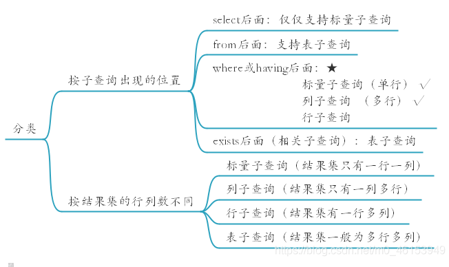

## Mysql 学习笔记 

### 一、DQL语言

#### 1.1 连接查询

- 含义：又称为多表查询，当查询的数据来自多个表时，就会用到连接查询
- 笛卡尔积现象：表1  有m行，表2 有n行，结果 = m*n行；
- 发生原因：没有有效的连接条件
- 如何避免：添加有效的连接条件
- 分类

```mysql
按年代分类：
	sql92标准:仅仅支持内连接
	sql99标准【推荐】：支持内连接+外连接（左外和右外）+交叉连接
	
按功能分类：
	内连接：
	等值连接
	非等值连接
	自连接
外连接：
	左外连接
	右外连接
	全外连接
		
交叉连接
```

#### 1.2 sql92标准案例

```mysql
#1.等值连接

/*
1.多表等值连接的结果为多表的交集部分
2.n表连接，至少需要n-1个连接条件
3.多表的顺序没有要求
4.一般需要为表起别名
5.可以搭配前面介绍的所有子句使用，比如排序，分组，筛选
*/
# 案例1：查询女神名和对应的男神名
select name,boyName from boys,beauty where beauty.boyfriend_id = boys.id;

#案例2：查询员工名和对应的部门名
select last_name,department_name from employees ,departments wheree employees.department_id=departments.department_id

#2.为表起别名

#1.提高语句的简洁度
#2.区分对个重名的字段
#注意：如果为表起了别名，则查询的字段就不能使用原来的表名去限定
#查询员工名、工种号、工种名
SELECT e.last_name,e.job_id,j.job_title FROM employees  e,jobs j
WHERE e.`job_id`=j.`job_id`;

#3.两个表的顺序是否可以调换

#查询员工名，工种号，工种名
select e.last_name,e.job_id,j.job_title from jobs j,employees e where e.job_id = j.job_id;

#4.可以加筛选

#案例1：查询有奖金的员工名，部门名
select last_name,department_name,commission_pct from employees e,departments d where e.department_id=d.department_id and e.commission_pct is not null;

#案例2：查询城市名中第二个字符为 o 的部门名和城市名
select department_name,city from departments d,locations l where d.location_id = l.location_id and city LIKE %_o% ;

#5.可以加分组
#案例1：查询每个城市的部门个数
select count(*) ,city from departments d,locations l where d.department_id = l.department_id group by city; 

#案例2：查询有奖金的每个部门的部门名和部门的领导编号和该部门的最低工资
select department_name,d.manager_id,MIN(salary) from departments d,employees e where commission_pct is not null group by department_name,d.manager_id;

#6.可以加排序
#案例：查询每个工种的工种名和员工的个数，并且按员工个数降序
select job_title,count(*) from employees e,jobs j where e.job_id = j.job_id gruop by job_title group by count(*) desc;

#7.可以实现三表连接？
#案例：查询员工名，部门名和所在的城市
select last_name,department_name,city from employees e,departments d,locations l where e.department_id = e.department_id and d.location_id = l.location_id and city like "s%" order by department_name desc;

#2.非等值连接
#案例1：查询员工的工资和工资级别
select salary,grade_level from employees e,job_grades g where salary between g.lowest_sal and g.highest_sal and g.grade_level = 'A';

#3、自连接
#案例：查询 员工名和上级的名称

SELECT e.employee_id,e.last_name,m.employee_id,m.last_name
FROM employees e,employees m
WHERE e.`manager_id`=m.`employee_id`;

```

#### 1.3 sql99标准案例

```mysql
select 查询列表
from 表1 别名 【连接类型】
join 表2 别名 
on 连接条件
【where 筛选条件】
【group by 分组】
【having 筛选条件】
【order by 排序列表】
```

- 分类

```mysql
内连接（★）：inner
外连接
	左外(★):left 【outer】
	右外(★)：right 【outer】
	全外：full【outer】
交叉连接：cross 
```

- 案例

```mysql
#一、内联接
#语法：select 查询列表 from 表名1 别名 inner join 表2 别名 on 连接条件;
#分类：
# 等值
# 非等值
# 自连接

# 特点：
# ①添加排序，分组，筛选 
② inner 可以省略 
③ 筛选条件放在where 后面，连接条件放在  on  后面，提高分离性，便于阅读 
④ inner join邻接和sql92 语法中的等值连接效果是一样的，都是查询表的交集
#1、等值连接
#案例1.查询员工名、部门名

SELECT last_name,department_name FROM departments d
INNER JOIN  employees e
ON e.`department_id` = d.`department_id`;

#案例2.查询名字中包含e的员工名和工种名（添加筛选）
SELECT last_name,job_title FROM employees e
INNER JOIN jobs j ON e.`job_id`=  j.`job_id`
WHERE e.`last_name` LIKE '%e%';

#案例3.查询部门个数 > 3的城市名和部门个数，(添加分组+筛选)
#1.查询每个城市的部门个数
#2.在1的基础上筛选满足条件的条数
select city , count(*) 部门个数 from departments d,locations l
where d.location_id=l.location_id group by city Having count(*) > 3;

#案例4：查询哪个部门的员工个数 > 3 的部门名和员工个数，并按个数降序(添加排序)
select department_name,count(*) from departments d,employees e
 where d.department_id = e.department_id group by department_name
 having count(*) > 3 order by count(*) des;

#案例5：查询员工名，部门名，工种名，并按部门名降序(添加三表连接)
select e.last_name,department_name,job_title from employees e ,departments d, jobs where e.department_id = d.department_id and e.job_id = j.job_id order by d.epartment_name desc;

#二、非等值连接
#查询员工的工资级别

select salary,grade_level from employees e,job_grades g where e.salary between g.lowest_sal and g.highest_sal;

#查询工资级别的个数 > 20的个数，并且按工资级别降序
select count(*),grade_level from employees e,job_grades j where 
e.`salary` BETWEEN g.`lowest_sal` AND g.`highest_sal` group by grade_level having count(*) > 20 order by grade_level desc;

#三、自连接
 
#查询员工的名字、上级的名字
SELECT e.last_name,m.last_name
FROM employees e
JOIN employees m
ON e.`manager_id`= m.`employee_id`;

#查询姓名中包含字符k的员工的名字、上级的名字
SELECT e.last_name,m.last_name
FROM employees e
JOIN employees m
ON e.`manager_id`= m.`employee_id`
WHERE e.`last_name` LIKE '%k%';

#二、外连接
 
/*
应用场景：用于查询一个表中有，另一个表没有的记录
 
特点：
1、外连接的查询结果为主表中的所有记录
	如果从表中有和它匹配的，则显示匹配的值
	如果从表中没有和它匹配的，则显示null
	外连接查询结果=内连接结果+主表中有而从表没有的记录
2、左外连接，left join左边的是主表
   右外连接，right join右边的是主表
3、左外和右外交换两个表的顺序，可以实现同样的效果 
4、全外连接=内连接的结果+表1中有但表2没有的+表2中有但表1没有的
*/
#引入：查询男朋友 不在男神表的的女神名

SELECT * FROM beauty;
SELECT * FROM boys;
 
#左外连接
SELECT b.*,bo.* FROM boys bo
LEFT OUTER JOIN beauty b
ON b.`boyfriend_id` = bo.`id`
WHERE b.`id` IS NULL;
 
#案例1：查询哪个部门没有员工
#左外
SELECT d.*,e.employee_id
FROM departments d
LEFT OUTER JOIN employees e
ON d.`department_id` = e.`department_id`
WHERE e.`employee_id` IS NULL;

#右外
 
SELECT d.*,e.employee_id
FROM employees e
RIGHT OUTER JOIN departments d
ON d.`department_id` = e.`department_id`
WHERE e.`employee_id` IS NULL;

#全外

USE girls;
SELECT b.*,bo.* FROM beauty b
FULL OUTER JOIN boys bo
ON b.`boyfriend_id` = bo.id;

#交叉连接

SELECT b.*,bo.* FROM beauty b
CROSS JOIN boys bo;


```

#### 1.4 子查询



```mysql
#一、where或having后面
/*
1、标量子查询（单行子查询）
2、列子查询（多行子查询）
3、行子查询（多列多行）

特点：
①子查询放在小括号内
②子查询一般放在条件的右侧
③标量子查询，一般搭配着单行操作符使用
> < >= <= = <>

列子查询，一般搭配着多行操作符使用
in、any/some、all

④子查询的执行优先于主查询执行，主查询的条件用到了子查询的结果
*/

#1.标量子查询★

#案例1：谁的工资比 Abel 高?
#①查询Abel的工资
SELECT salary
FROM employees
WHERE last_name = 'Abel';

#②查询员工的信息，满足 salary>①结果
SELECT * FROM employees WHERE salary>(
	SELECT salary
	FROM employees
	WHERE last_name = 'Abel'	
);
#案例2：返回job_id与141号员工相同，salary比143号员工多的员工 姓名，job_id 和工资

#①查询141号员工的job_id
#案例2：返回job_id与141号员工相同，salary比143号员工多的员工 姓名，job_id 和工资

#①查询141号员工的job_id
SELECT job_id FROM employees
WHERE employee_id = 141;

#②查询143号员工的salary
SELECT salary FROM employees
WHERE employee_id = 143;

#③查询员工的姓名，job_id 和工资，要求job_id=①并且salary>②

SELECT last_name,job_id,salary FROM employees WHERE job_id = (
	SELECT job_id
	FROM employees
	WHERE employee_id = 141
) AND salary>(
	SELECT salary
	FROM employees
	WHERE employee_id = 143
);

#案例3：返回公司工资最少的员工的last_name,job_id和salary

#①查询公司的最低工资
SELECT MIN(salary) FROM employees;

#②查询last_name,job_id和salary，要求salary=①
SELECT last_name,job_id,salary
FROM employees
WHERE salary=(
	SELECT MIN(salary)
	FROM employees
);

#案例4：查询最低工资大于50号部门最低工资的部门id和其最低工资

#①查询50号部门的最低工资
SELECT  MIN(salary)
FROM employees
WHERE department_id = 50;

#②查询每个部门的最低工资

SELECT MIN(salary),department_id
FROM employees
GROUP BY department_id;

#③ 在②基础上筛选，满足min(salary)>①
SELECT MIN(salary),department_id FROM employees GROUP BY department_id HAVING MIN(salary)>(
	SELECT  MIN(salary)
	FROM employees
	WHERE department_id = 50
);

#非法使用标量子查询
SELECT MIN(salary),department_id FROM employees GROUP BY  department_id HAVING MIN(salary)>(
	SELECT  salary
	FROM employees
	WHERE department_id = 250
);

#2.列子查询（多行子查询）★
#案例1：返回location_id是1400或1700的部门中的所有员工姓名

#①查询location_id是1400或1700的部门编号
SELECT DISTINCT department_id
FROM departments
WHERE location_id IN(1400,1700);

#②查询员工姓名，要求部门号是①列表中的某一个

SELECT last_name
FROM employees
WHERE department_id  <> IN (
	SELECT DISTINCT department_id
	FROM departments
	WHERE location_id IN(1400,1700)
);


#案例2：返回其它工种中比job_id为‘IT_PROG’工种任一工资低的员工的员工号、姓名、job_id 以及salary

#①查询job_id为‘IT_PROG’部门任一工资

SELECT DISTINCT salary FROM employees
WHERE job_id = 'IT_PROG';

#②查询员工号、姓名、job_id 以及salary，salary<(①)的任意一个
SELECT last_name,employee_id,job_id,salary
FROM employees
WHERE salary<ANY(
	SELECT DISTINCT salary
	FROM employees
	WHERE job_id = 'IT_PROG'

) AND job_id<>'IT_PROG';

#或
SELECT last_name,employee_id,job_id,salary
FROM employees
WHERE salary<(
	SELECT MAX(salary)
	FROM employees
	WHERE job_id = 'IT_PROG'

) AND job_id<>'IT_PROG';


#案例3：返回其它部门中比job_id为‘IT_PROG’部门所有工资都低的员工   的员工号、姓名、job_id 以及salary

SELECT last_name,employee_id,job_id,salary
FROM employees
WHERE salary<ALL(
	SELECT DISTINCT salary
	FROM employees
	WHERE job_id = 'IT_PROG'

) AND job_id<>'IT_PROG';

#或

SELECT last_name,employee_id,job_id,salary
FROM employees
WHERE salary<(
	SELECT MIN( salary)
	FROM employees
	WHERE job_id = 'IT_PROG'

) AND job_id<>'IT_PROG';

#3、行子查询（结果集一行多列或多行多列）

#案例：查询员工编号最小并且工资最高的员工信息

SELECT * FROM employees
WHERE (employee_id,salary)=(
	SELECT MIN(employee_id),MAX(salary)
	FROM employees
);

#①查询最小的员工编号
SELECT MIN(employee_id) FROM employees;

#②查询最高工资
SELECT MAX(salary) FROM employees;

#③查询员工信息
SELECT * FROM employees
WHERE employee_id=(
	SELECT MIN(employee_id)
	FROM employees
)AND salary=(
	SELECT MAX(salary)
	FROM employees
);


#二、select后面
/*
仅仅支持标量子查询
*/

#案例：查询每个部门的员工个数

SELECT d.*,(
	SELECT COUNT(*)
	FROM employees e
	WHERE e.department_id = d.`department_id`
 ) 个数
 FROM departments d;
 
 
#案例2：查询员工号=102的部门名
 
SELECT (
	SELECT department_name,e.department_id
	FROM departments d
	INNER JOIN employees e
	ON d.department_id=e.department_id
	WHERE e.employee_id=102
	
) 部门名;

#三、from后面
/*
将子查询结果充当一张表，要求必须起别名
*/

#案例：查询每个部门的平均工资的工资等级
#①查询每个部门的平均工资
SELECT AVG(salary),department_id
FROM employees GROUP BY department_id;

SELECT * FROM job_grades;

#②连接①的结果集和job_grades表，筛选条件平均工资 between lowest_sal and highest_sal

SELECT  ag_dep.*,g.`grade_level`
FROM (
	SELECT AVG(salary) ag,department_id
	FROM employees
	GROUP BY department_id
) ag_dep
INNER JOIN job_grades g
ON ag_dep.ag BETWEEN lowest_sal AND highest_sal;

#四、exists后面（相关子查询）
/*
语法：
exists(完整的查询语句)
结果：
1或0
*/
SELECT EXISTS(SELECT employee_id FROM employees WHERE salary=300000);

#案例1：查询有员工的部门名

#in
SELECT department_name
FROM departments d
WHERE d.`department_id` IN(
	SELECT department_id
	FROM employees
);

#exists
SELECT department_name
FROM departments d
WHERE EXISTS(
	SELECT *
	FROM employees e
	WHERE d.`department_id`=e.`department_id`
);

#案例2：查询没有女朋友的男神信息

#in
SELECT bo.*
FROM boys bo
WHERE bo.id NOT IN(
	SELECT boyfriend_id
	FROM beauty
);

#exists
SELECT bo.*
FROM boys bo
WHERE NOT EXISTS(
	SELECT boyfriend_id
	FROM beauty b
	WHERE bo.`id`=b.`boyfriend_id`

```

#### 1.5 分页查询

- 应用场景：当要显示的数据，一页显示不全，需要分页提交sql请求。
- 语法：

```mysql
select 查询列表 from 表 【join type 表2 on 连接条件 where 筛选条件 group by 分组字段 having 分组后的筛选 order by 排序的字段】 limit 【offset】, size;
注意：
	offset 要显示条目的起始索引(起始索引从0开始)
	size 要显示的条目个数

```

- 特点

```mysql
limit 语句放在查询语句的最后
公式 
	要显示的页数 page  ，每页的条目数 size
	
select 查询列表 from 表 limit (page - 1) * size ,size;
size = 10
page  
1    0
2    10
3    20

```

```mysql
# 案例1：查询前五条员工信息
select * from employees limit 0,5;
select * from employees limit 5;

# 案例2：查询第11条-----第25 条
select * from employees limit 10 , 15;

#案例3：有奖金的员工信息，并且工资较高的前10名显示出来
select * from employees where commission_pct is not null order by salary desc limit 10;

```

#### 1.6 联合查询

- 含义：union（联合，合并）：将多个查询语句的结果合并成一个结果。

```mysql
查询语句1
union 【all】
查询语句2
union 【all】
...

```

意义：

- 将一条比较复杂的查询语句拆分成多条语句
- 适用查询多个表的时候，查询的例基本是一致。

特点：

- 要求多条查询语句的查询列数是一致的！
- 要求多条查询语句的查询的每一列的类型和顺序最好一致
- union关键字默认去重，如果使用union all 可以包含重复项。

```mysql
# 查询部门编号>90或邮箱包含a的员工信息
select * from employees where email like '%a%' or department_id > 90

select * from employees where email like '%a%' union select * from employees where department_id > 90
```

- 此处需要的数据库源文件

```mysql
/*
 Navicat MySQL Data Transfer

 Source Server         : localhost
 Source Server Type    : MySQL
 Source Server Version : 50145
 Source Host           : localhost:3306
 Source Schema         : test

 Target Server Type    : MySQL
 Target Server Version : 50145
 File Encoding         : 65001

 Date: 03/07/2020 11:08:32
*/

SET NAMES utf8mb4;
SET FOREIGN_KEY_CHECKS = 0;

-- ----------------------------
-- Table structure for t_ca
-- ----------------------------
DROP TABLE IF EXISTS `t_ca`;
CREATE TABLE `t_ca`  (
  `id` int(20) NOT NULL,
  `cname` varchar(255) CHARACTER SET utf8 COLLATE utf8_general_ci NULL DEFAULT NULL,
  `csex` varchar(255) CHARACTER SET utf8 COLLATE utf8_general_ci NULL DEFAULT NULL,
  PRIMARY KEY (`id`) USING BTREE
) ENGINE = InnoDB CHARACTER SET = utf8 COLLATE = utf8_general_ci ROW_FORMAT = Compact;

-- ----------------------------
-- Records of t_ca
-- ----------------------------
INSERT INTO `t_ca` VALUES (1, '韩梅梅', '女');
INSERT INTO `t_ca` VALUES (2, '李雷', '男');
INSERT INTO `t_ca` VALUES (3, '李明', '男');

SET FOREIGN_KEY_CHECKS = 1;


/*
 Navicat MySQL Data Transfer

 Source Server         : localhost
 Source Server Type    : MySQL
 Source Server Version : 50145
 Source Host           : localhost:3306
 Source Schema         : test

 Target Server Type    : MySQL
 Target Server Version : 50145
 File Encoding         : 65001

 Date: 03/07/2020 11:09:05
*/

SET NAMES utf8mb4;
SET FOREIGN_KEY_CHECKS = 0;

-- ----------------------------
-- Table structure for t_ua
-- ----------------------------
DROP TABLE IF EXISTS `t_ua`;
CREATE TABLE `t_ua`  (
  `t_id` int(11) NOT NULL,
  `tName` varchar(255) CHARACTER SET utf8 COLLATE utf8_general_ci NULL DEFAULT NULL,
  `tGender` varchar(255) CHARACTER SET utf8 COLLATE utf8_general_ci NULL DEFAULT NULL,
  PRIMARY KEY (`t_id`) USING BTREE
) ENGINE = InnoDB CHARACTER SET = utf8 COLLATE = utf8_general_ci ROW_FORMAT = Compact;

-- ----------------------------
-- Records of t_ua
-- ----------------------------
INSERT INTO `t_ua` VALUES (1, 'john', 'male');
INSERT INTO `t_ua` VALUES (2, 'lucy', 'female');
INSERT INTO `t_ua` VALUES (3, 'lily', 'female');
INSERT INTO `t_ua` VALUES (4, 'jack', 'male');
INSERT INTO `t_ua` VALUES (5, 'rose', 'female');

SET FOREIGN_KEY_CHECKS = 1;

```


